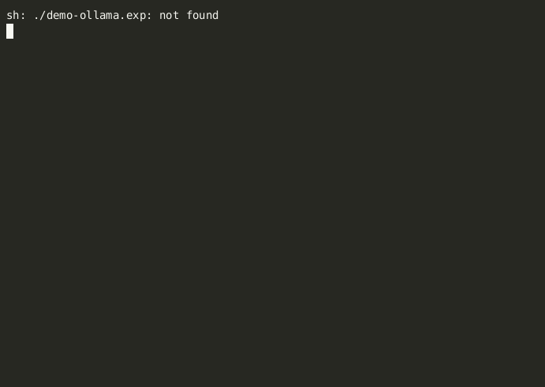

# Demo Gallery

## Mock Backend Demo


The mock backend provides instant responses without requiring any API keys or external services. It randomly returns either conversational responses or tool calls with a 50/50 split, perfect for testing the agent framework.

### Features Demonstrated:
- Immediate responses (no API latency)
- Random tool calling behavior
- No setup required

### Run it yourself:
```bash
./guile-agent-v2 -b mock
```

## Ollama Backend Demo (llama3.2)


The Ollama backend enables completely offline operation with local language models. This demo uses llama3.2:3b, a compact model that runs well on modest hardware.

### Features Demonstrated:
- Local LLM integration
- Tool detection from natural language
- Offline operation

### Run it yourself:
```bash
# Start Ollama server (if not running)
ollama serve

# Run with llama3.2
./guile-agent-v2 -b ollama -m llama3.2:3b
```

## Available Models for Ollama

Based on your system's installed models:

| Model | Size | Best For | Command |
|-------|------|----------|---------|
| llama3.2:3b | 2.0 GB | General conversation, low memory | `./guile-agent-v2 -b ollama -m llama3.2:3b` |
| llama3.2:latest | 2.0 GB | Default llama3.2 | `./guile-agent-v2 -b ollama -m llama3.2` |
| qwen2.5-coder:7b | 4.7 GB | Code-focused tasks | `./guile-agent-v2 -b ollama -m qwen2.5-coder:7b` |
| llama3.2-vision:11b | 7.8 GB | Multimodal (if extended) | `./guile-agent-v2 -b ollama -m llama3.2-vision:11b` |

## Quick Start Commands

### Mock Backend (No Setup)
```bash
./guile-agent-v2 -b mock
```

### Ollama Backend
```bash
# List available models
./guile-agent-v2 -b ollama --list-models

# Use specific model
./guile-agent-v2 -b ollama -m llama3.2:3b
```

### Anthropic Backend
```bash
# With environment variable
export ANTHROPIC_API_KEY="your-key"
./guile-agent-v2 -b anthropic

# With command line
./guile-agent-v2 -b anthropic -k "your-key"
```

## Recording Your Own Demos

### Using asciinema:
```bash
# Start recording
asciinema rec my-demo.cast

# Run the agent
./guile-agent-v2 -b mock

# Stop recording with Ctrl+D
```

### Convert to GIF:
```bash
# Install agg if needed
pip install asciinema-gif-generator

# Convert
agg my-demo.cast my-demo.gif --theme monokai
```

## Tool Demonstrations

The agent supports various tools out of the box:

### Weather Tool
```
> What's the weather in San Francisco?
Assistant: I'll check the weather for you.
The weather in San Francisco, CA is currently 22° C with partly cloudy skies.
```

### Calculator Tool
```
> Calculate 42 * 17
Assistant: Let me calculate that for you.
Result: 714
```

### Custom Tools
See `examples/custom-tool.scm` for creating your own tools like:
- DateTime tool
- Dice rolling tool
- String manipulation tool

## Tips for Best Results

1. **Mock Backend**: Great for testing tool integration without API costs
2. **Ollama with llama3.2:3b**: Best balance of speed and quality for local use
3. **Anthropic**: Most sophisticated responses but requires API key

## Troubleshooting

If demos aren't working:

1. Check Guile version: `guile --version` (needs 2.2+)
2. For Ollama: Ensure server is running: `ollama serve`
3. For Anthropic: Verify API key: `echo $ANTHROPIC_API_KEY`